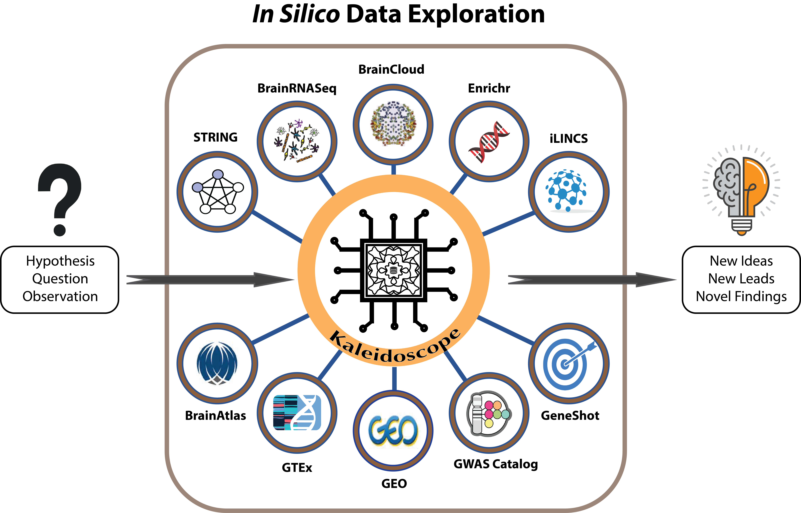

```{r setup, include=FALSE}
knitr::opts_chunk$set(echo = TRUE)
```

## Kaleidoscope

Kaleidoscope provides easy access to several databases and tools under a unified user interface to explore research questions in silico. The web application is open-source and freely available at https://kalganem.shinyapps.io/Kaleidoscope/. This application streamlines the process of in silico data exploration for users and expands the efficient use of these tools to stakeholders without specific bioinformatics expertise.


## Workflow



