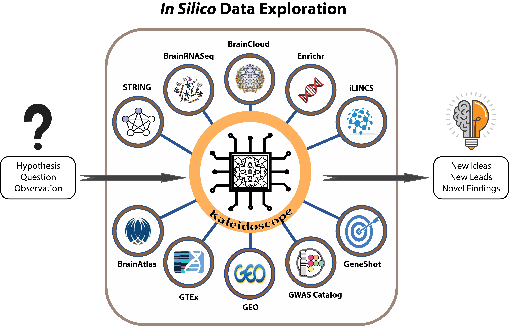

## Kaleidoscope

Kaleidoscope provides easy access to several databases and tools under a
unified user interface to explore research questions in silico. The web
application is open-source and freely available at
<https://kalganem.shinyapps.io/Kaleidoscope/>. This application
streamlines the process of in silico data exploration for users and
expands the efficient use of these tools to stakeholders without
specific bioinformatics expertise.

## Aims

Kaleidoscope aims to be a bioinformatics pipeline for in silico
hypothesis exploration. We curated multi-omics datasets across different
databases to streamline the process of in silico data exploration of
omics signatures for researchers. We utilized application programing
interfaces (APIs) of sveral bioinformatics tools and databases and made
them accessible to users under one platform with a standardized user
interface. Currently, Kaleidoscope integrates data from Brain RNA-Seq,
BrainCloud, BrainAtlas, STRING, iLINCS, Enrichr, GeneShot, and GWAS
Catalog, as well as over 350 (and counting) disease-related differential
gene expression datasets. The application is designed to be
user-friendly with a unified user interface, while also scalable by
offering the option of uploading user-defined datasets.

## Workflow

## Interface

We wanted to have a user freindly interface so each tab has a similar
structure: Text box, and action buton. Separate your gene symbols with a
comma
